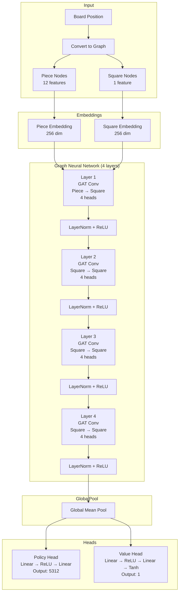

# RivalAI Chess Engine

A novel chess engine implementing the Chess Heterogeneous Encoding State System (CHESS) for position representation, combined with Monte Carlo Tree Search (MCTS) and Graph Neural Networks (GNNs) for evaluation and policy decisions. CHESS transforms chess positions into rich graph structures, known as Positional Adjacency Graphs (PAG), that capture piece relationships, strategic importance, and positional dynamics.

## Project Structure

```
rival_ai/
├── engine/           # Rust core engine
│   ├── src/         # Core chess logic and implementation
│   │   ├── game_storage.rs  # Game persistence system
│   │   ├── mcts.rs         # Monte Carlo Tree Search
│   │   ├── pag/           # Position Analysis Graph
│   │   └── bin/          # Binary executables
│   ├── examples/    # Example usage and tests
│   └── web/         # Web interface components
│       ├── src/    # React frontend
│       │   ├── components/  # UI components
│       │   │   ├── Chessboard.tsx    # Chess board visualization
│       │   │   ├── CommunityGame.tsx # Community voting interface
│       │   │   └── ModelStats.tsx    # Engine statistics
│   ├── python/          # Python training and analysis
│   │   ├── src/        # Core Python implementation
│   │   ├── scripts/    # Training and utility scripts
│   │   └── analysis/   # Analysis tools and notebooks
│   ├── analysis/        # Project-wide analysis tools
│   ├── scripts/         # Utility scripts
│   ├── experiments/     # Training experiment outputs
│   └── self_play_data/ # Generated self-play games
│   └── logs/           # Training and runtime logs
```

## Game Modes

RivalAI now supports two distinct game modes:

### 1. Single Player Mode
- Traditional one-on-one gameplay against the AI
- Full engine strength with MCTS and neural network evaluation
- Move history and analysis
- Game state persistence
- Customizable player color

### 2. Community Mode
- Collaborative gameplay where multiple players vote on moves
- 10-second voting window for each move
- Real-time vote tallying
- Move suggestions from all connected players
- Random selection between tied moves
- Ability to change votes during voting window
- Game state persistence with voting history

## Game Storage System

RivalAI implements a robust game storage system that preserves game states and supports multiple game modes:

### Storage Structure
```
games/
├── single_player/   # Single player game files
│   └── [game_id].json
└── community/       # Community game files
    └── [game_id].json
```

### Game Metadata
Each saved game includes:
- Game ID (UUID)
- Game mode (single/community)
- Creation timestamp
- Last move timestamp
- Game status
- Total moves
- Player color
- Player name (optional)
- Engine version

### Features
- Automatic game state persistence
- Game resume capability
- Historical game browsing
- Mode-specific storage
- Rich game metadata
- Efficient JSON storage
- Directory-based organization

## Model Architecture

The ChessGNN model uses a Graph Neural Network architecture to process chess positions represented as Positional Adjacency Graphs (PAG). Here's the complete architecture:



Key components:

1. **Input Processing**:
   - Takes a chess board position
   - Converts it to a graph with piece nodes (12 features) and square nodes (1 feature)

2. **Embeddings**:
   - Piece nodes are embedded into 256 dimensions
   - Square nodes are embedded into 256 dimensions

3. **Graph Neural Network** (4 layers):
   - First layer: Connects pieces to squares using Graph Attention (GAT) with 4 heads
   - Next 3 layers: Square-to-square connections using GAT with 4 heads
   - Each layer followed by LayerNorm and ReLU activation
   - Dropout (0.1) applied after each layer

4. **Global Pooling**:
   - Global mean pooling over all square features

5. **Output Heads**:
   - Policy Head: Outputs move probabilities (5312 possible moves)
     - Linear → ReLU → Dropout → Linear
   - Value Head: Outputs position evaluation (-1 to 1)
     - Linear → ReLU → Dropout → Linear → Tanh

The architecture leverages several key features:
- Graph Attention Networks (GAT) for message passing
- Residual connections for better gradient flow
- Multi-head attention (4 heads) for capturing different aspects of piece relationships
- Separate policy and value heads for move selection and position evaluation
- Dropout and layer normalization for regularization and training stability

## Setup Instructions

### Prerequisites

1. Install Rust:
```bash
curl --proto '=https' --tlsv1.2 -sSf https://sh.rustup.rs | sh
```

2. Install Python 3.8+ and create a virtual environment:
```bash
# Create virtual environment
python -m venv venv

# Activate virtual environment
# On Windows:
venv\Scripts\activate
# On Linux/Mac:
source venv/bin/activate
```

3. Install required packages:
```bash
# Install all dependencies from requirements.txt
pip install -r requirements.txt
```

### Building the Project

1. Build the Rust engine:
```bash
cd engine
cargo build
```

2. Set up Python environment:
```bash
# Make sure your virtual environment is activated
pip install -e .  # Install the Python package in development mode
```

## Training

### Basic Training

To train the model with default settings:

```bash
# Make sure your virtual environment is activated
python python/scripts/train.py --experiment-name rival_ai_v1 --tensorboard
```

### Advanced Training

For more control over the training process, you can customize various parameters:

```bash
python python/scripts/train.py \
    --num-epochs 100 \              # Number of training epochs
    --batch-size 32 \               # Training batch size
    --learning-rate 0.001 \         # Initial learning rate
    --weight-decay 1e-4 \           # L2 regularization
    --grad-clip 1.0 \               # Gradient clipping value
    --patience 10 \                 # Early stopping patience (planned)
    --val-split 0.1 \               # Validation split ratio (planned)
    --warmup-epochs 5 \             # Learning rate warmup epochs (planned)
    --num-games 100 \               # Self-play games per epoch
    --num-simulations 800 \         # MCTS simulations per move
    --temperature 1.0 \             # Move selection temperature
    --experiment-name rival_ai_v1 \ # Experiment name for logging
    --tensorboard \                 # Enable TensorBoard logging
    --log-level INFO                # Set logging level (DEBUG, INFO, WARNING, ERROR, CRITICAL)
```

### Training Output

The training process generates:
- Model checkpoints in `checkpoints/<experiment_name>/`
- Self-play games in `self_play_data/`
- Training logs in `logs/`
- TensorBoard visualizations in `runs/` (if enabled)

Current training metrics include:
- Policy loss
- Value loss
- Total loss
- Entropy
- L2 regularization

### Monitoring Training

You can monitor training progress in several ways:

1. **TensorBoard (Recommended)**
   - Real-time visualization of training metrics
   - Access at `http://localhost:6006` after starting tensorboard
   - Shows:
     - Loss curves (policy, value, total)
     - Entropy
     - L2 regularization
     - Game statistics (planned)

2. **Log Files**
   - Check the logs directory for detailed training logs:
   ```bash
   # On Windows:
   type logs\training.log
   # On Linux/Mac:
   tail -f logs/training.log
   ```

3. **Checkpoints**
   - Monitor model improvements in the checkpoints directory:
   ```bash
   # On Windows:
   dir checkpoints\rival_ai_v1
   # On Linux/Mac:
   ls -l checkpoints/rival_ai_v1/
   ```
   - Checkpoints are saved after each epoch
   - Metrics are included in checkpoint files

### Debugging and Logging

For detailed debugging of the training process, use the `--log-level DEBUG` option:

```bash
python python/scripts/train.py --experiment-name rival_ai_debug --log-level DEBUG
```

This will show:
- MCTS exploration details:
  - Top moves considered at each position
  - Move probabilities from policy network
  - Position evaluations from value network
  - Visit counts and values for explored moves
- Game state transitions
- Training metrics and statistics
- Model predictions and updates

The debug logs are particularly useful for:
- Understanding how the model learns from random weights
- Verifying MCTS exploration behavior
- Diagnosing training issues
- Monitoring policy and value network predictions

To view training progress with TensorBoard:
```bash
# Make sure your virtual environment is activated
tensorboard --logdir runs
```

Then open your browser to `http://localhost:6006` to view:
- Loss curves (policy loss, value loss, total loss)
- Policy accuracy (top-1 and top-3)
- Value prediction accuracy
- Learning rate schedule
- Game statistics (win rates, draw rates, average game length)

## Current Status

### Implemented Features
- [x] PAG-based position representation
- [x] GNN model with policy and value heads
- [x] MCTS with GNN integration
- [x] Self-play data generation
- [x] Training pipeline with metrics
- [x] Model checkpointing
- [x] TensorBoard integration

### In Progress
- [ ] Early stopping
- [ ] Learning rate scheduling
- [ ] Distributed training
- [ ] Training data augmentation
- [ ] Memory optimization
- [ ] Performance profiling

### Planned Features
- [ ] UCI protocol support
- [ ] Transposition tables
- [ ] Adaptive MCTS parameters
- [ ] Advanced training techniques
- [ ] Endgame tablebases

## Model Learning Process Diagram

- The model learning process has been diagrammed in Mermaid format. If present, see the project root for a `.mmd` file (e.g., `model_learning_flowchart.mmd`).
- Aggressive anti-draw and anti-repetition penalties are implemented and tested in the training pipeline.
- To export Mermaid diagrams to images, install Mermaid CLI (`npm install -g @mermaid-js/mermaid-cli`) and use the `mmdc` command. See MILESTONES.md for details.

## Development

See [DESIGN.md](DESIGN.md) for detailed architecture documentation and [MILESTONES.md](MILESTONES.md) for development roadmap.

## License

MIT License - See LICENSE file for details

## Web Interface

The web interface provides a rich user experience with:

### Common Features
- Interactive chessboard
- Move validation
- Game controls
- Theme customization
- Model statistics
- Move history

### Single Player Features
- Direct gameplay against AI
- Move analysis
- Game state tracking
- Position evaluation

### Community Mode Features
- Real-time vote display
- Countdown timer
- Vote statistics
- Move suggestions
- Vote modification
- Game state synchronization

## API Endpoints

### Game Management
- `POST /api/move/{game_id}` - Make a move in single player mode
- `GET /api/games` - List all saved games
- `GET /api/games/{mode}/{game_id}` - Load a specific game
- `DELETE /api/games/{mode}/{game_id}` - Delete a game

### Community Mode
- `POST /api/community/start` - Start a new community game
- `POST /api/community/vote` - Submit or update a vote
- `GET /api/community/state` - Get current game state 