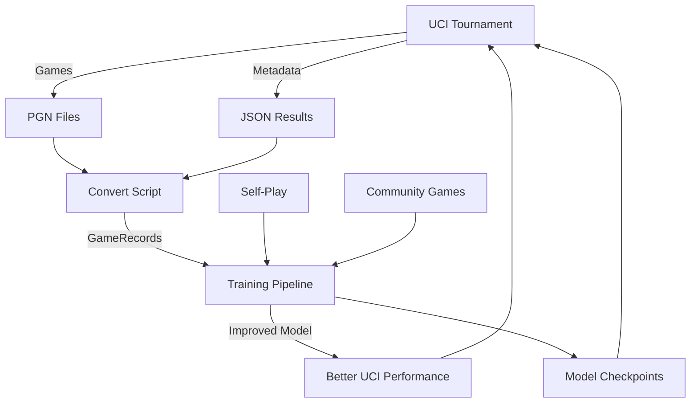

# RivalAI UCI Integration 🏆

**Transform RivalAI's training challenges into competitive advantage through Universal Chess Interface support.**

## Overview

This UCI integration directly addresses RivalAI's **training data shortage** and **community-driven improvement needs** by:

1. **🎯 Automated Training Data Collection**: Every engine match becomes valuable training data
2. **📊 Objective Strength Assessment**: Benchmark against established engines like Stockfish
3. **🔄 Continuous Improvement Loop**: Battle → Learn → Improve → Battle
4. **🌍 Community Accessibility**: Standard interface for wider adoption and feedback

## Quick Start

```bash
# 1. Setup and build
chmod +x setup_uci.sh
./setup_uci.sh

# 2. Test basic functionality
cd engine
echo "uci" | ./target/release/uci

# 3. Run first tournament (saves training data automatically)
python3 scripts/uci_tournament.py --games 5 --time 3.0

# 4. Convert games to training format and train model
python3 scripts/convert_uci_games.py uci_tournament_results
python3 python/scripts/train.py  # Uses UCI games + self-play data
```

## Architecture

### UCI Engine (`engine/src/bin/uci.rs`)
- **Full UCI Protocol**: Compatible with all chess GUIs and tournament software
- **Integrated Training Data Collection**: Automatically saves games in RivalAI format
- **PAG-Enhanced Options**: Exposes RivalAI's unique features via UCI options
- **Real-time Game Storage**: Each match feeds directly into training pipeline

### Tournament System (`scripts/uci_tournament.py`)
- **Automated Engine Battles**: Orchestrate matches against multiple opponents
- **Comprehensive Statistics**: Track win rates, performance trends, time usage
- **PGN Export**: Standard format for analysis and sharing
- **Parallel Processing**: Efficient multi-engine tournament management

### Training Integration (`scripts/convert_uci_games.py`)
- **Seamless Data Pipeline**: Convert UCI games to RivalAI's `GameRecord` format
- **Automatic Value Estimation**: Infer position values from final results
- **Direct Training Feed**: Games appear in `python/training_games/uci_matches/`
- **Quality Metrics**: Track data quality and game characteristics

## Solving RivalAI's Training Challenges

### 1. **Data Scarcity → Data Abundance**

**Before UCI**: Limited to self-play games with undertrained model
```
Training Data Sources:
├── Self-play games (limited quality due to weak model)
└── Community votes (sparse, async)
```

**After UCI**: Rich, diverse training data from engine battles
```
Training Data Sources:
├── Self-play games (improving quality)
├── Community votes (ongoing)
├── UCI vs Stockfish (tactical strength)
├── UCI vs Leela Chess Zero (positional understanding)
├── UCI vs other engines (diverse styles)
└── Tournament games (objective evaluation)
```

### 2. **Isolated Development → Community Integration**

**Standard Interface Access**: 
- Chess GUIs (Arena, ChessBase, Fritz)
- Tournament platforms (TCEC, Chess.com)
- Analysis tools (researchers, developers)
- Educational platforms (chess learning)

**Community Feedback Loop**:
```
RivalAI Plays Public Games
    ↓
Community Analyzes Performance
    ↓
Identifies Weaknesses/Strengths
    ↓
Focused Training/Improvement
    ↓
Better Model → Better Games → More Analysis
```

### 3. **Subjective Assessment → Objective Benchmarks**

**Measurable Progress**:
```bash
# Track improvement over time
Tournament 1: vs Stockfish 15% win rate
Tournament 2: vs Stockfish 22% win rate  
Tournament 3: vs Stockfish 28% win rate
```

**Multi-Engine Evaluation**:
- **Stockfish**: Tactical benchmark
- **Leela Chess Zero**: Neural network comparison
- **Traditional engines**: Classical chess understanding
- **Specialized engines**: Opening theory, endgame technique

## Features & Benefits

### 🎯 **Training Data Quality**
- **Objective Outcomes**: Clear win/loss/draw results
- **Diverse Opponents**: Different playing styles and strengths
- **Known Benchmarks**: Compare against engines with established ratings
- **High Game Density**: Can generate hundreds of games quickly

### 📊 **Performance Tracking**
```python
# Automatic statistics tracking
{
  "overall_stats": {
    "total_wins": 42,
    "total_losses": 31, 
    "total_draws": 27,
    "win_rate": 42.0,
    "score": 55.5
  },
  "vs_stockfish": {"win_rate": 25.0},
  "vs_leela": {"win_rate": 18.0}
}
```

### 🔄 **Continuous Improvement**
1. **Play tournaments** → Collect games
2. **Convert to training data** → Feed into pipeline  
3. **Train model** → Improve neural network
4. **Repeat tournaments** → Measure improvement
5. **Share results** → Community validation

### 🌍 **Community Accessibility**
- **Standard Protocol**: Works with any UCI-compatible software
- **Easy Installation**: Single binary, no complex setup
- **Tournament Ready**: Can participate in computer chess events
- **Research Platform**: Accessible for academic studies

## Usage Examples

### Basic Engine Testing
```bash
# Test against Stockfish
python3 scripts/uci_tournament.py \
  --engines stockfish \
  --games 10 \
  --time 5.0 \
  --output stockfish_test

# Results automatically saved:
# - PGN games in stockfish_test/pgn/
# - JSON statistics in stockfish_test/tournament_results.json
# - Training data in python/training_games/uci_matches/
```

### Multi-Engine Benchmark
```bash
# Comprehensive evaluation
python3 scripts/uci_tournament.py \
  --engines stockfish lc0 komodo \
  --games 20 \
  --time 10.0 \
  --output benchmark_suite

# Convert all games to training data
python3 scripts/convert_uci_games.py benchmark_suite
```

### Custom UCI Session
```bash
cd engine
./target/release/uci

# Configure RivalAI features
> setoption name PAG_Mode value true
> setoption name MCTS_Simulations value 2000
> setoption name Training_Mode value true

# Play against position
> position fen rnbqkbnr/pppppppp/8/8/4P3/8/PPPP1PPP/RNBQKBNR b KQkq e3 0 1
> go movetime 10000
bestmove e7e5
```

### Training Integration
```python
# Training pipeline automatically includes UCI games
from rival_ai.training import Trainer

trainer = Trainer(config)
trainer.train()  # Uses self-play + UCI + community data
```

## Advanced Configuration

### UCI Engine Options
```bash
# Core engine settings
setoption name Hash value 128                    # Memory for hash tables
setoption name MCTS_Simulations value 1000       # Search depth
setoption name PAG_Mode value true               # Enable PAG features

# Training data collection  
setoption name Training_Mode value true          # Collect training data
setoption name Collect_Data value true           # Save games
setoption name Neural_Model_Path value /path/to/model.pt

# Performance tuning
setoption name Clear Hash                        # Reset hash tables
```

### Tournament Configuration
```python
# Custom tournament setup
config = TournamentConfig(
    rival_ai_path="engine/target/release/uci",
    opponent_engines=[
        EngineConfig("Stockfish", "stockfish", {"Hash": "64"}, 5.0),
        EngineConfig("LC0", "lc0", {"Threads": "2"}, 10.0),
    ],
    games_per_opponent=50,
    save_pgn=True,
    save_training_data=True
)
```

## File Structure

```
RivalAI/
├── engine/src/bin/uci.rs              # UCI engine implementation
├── engine/src/game_storage.rs         # Extended with UCI game mode
├── scripts/uci_tournament.py          # Tournament orchestration
├── scripts/convert_uci_games.py       # Training data conversion
├── setup_uci.sh                       # Setup and build script
├── UCI_INTEGRATION.md                 # This documentation
└── python/training_games/
    ├── uci_matches/                    # UCI games (raw format)
    └── uci_matches/processed/          # Training data (GameRecord format)
```

## Training Data Flow



## Performance Expectations

### Training Data Volume
```bash
# Expected data generation rates
Short tournament (10 games):  ~200 positions for training
Medium tournament (50 games): ~1000 positions for training  
Large tournament (200 games): ~4000 positions for training

# Quality comparison
UCI games:     High-quality tactical positions
Self-play:     Varied quality (improving over time)
Community:     Strategic decisions, lower frequency
```

### Computational Requirements
- **UCI Engine**: ~100ms per move (configurable)
- **Tournament**: ~1-5 minutes per game (depends on time control)
- **Conversion**: ~1 second per game for training data format
- **Training**: Standard RivalAI training pipeline (uses all data sources)

## Troubleshooting

### Common Issues

**UCI Engine Won't Start**
```bash
# Check model path
ls -la ../python/experiments/rival_ai_v1_Alice/run_*/checkpoints/

# Test Python integration
cd engine
python3 -c "import sys; sys.path.append('../python/src'); from rival_ai.models import ChessGNN"
```

**Tournament Fails**
```bash
# Test opponent engine
stockfish
> uci
> quit

# Check python-chess
python3 -c "import chess.engine; print('OK')"
```

**Training Data Not Generated**
```bash
# Check UCI game storage
ls -la python/training_games/uci_matches/

# Verify conversion
python3 scripts/convert_uci_games.py uci_tournament_results --output test_conversion
```

## Next Steps

1. **🏁 Get Started**: Run `./setup_uci.sh` and test basic functionality
2. **🎯 First Tournament**: Battle against Stockfish to establish baseline
3. **📊 Analyze Results**: Review PGN games and identify improvement areas  
4. **🔄 Training Loop**: Convert games and retrain model
5. **📈 Track Progress**: Run regular tournaments to measure improvement
6. **🌍 Share Results**: Contribute to chess AI research community

## Contributing

The UCI integration opens RivalAI to the entire chess engine community:

- **Engine Developers**: Compare against RivalAI's PAG approach
- **Researchers**: Study graph neural networks in chess
- **Tournament Organizers**: Include RivalAI in engine competitions
- **Chess Players**: Analyze games and suggest improvements

Every match makes RivalAI stronger. Every improvement benefits the entire community.

---

**🚀 Ready to turn engine battles into training breakthroughs!** 